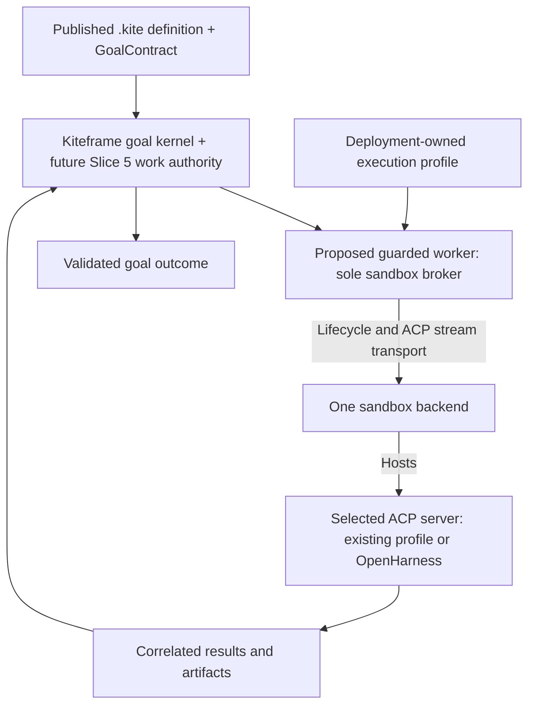
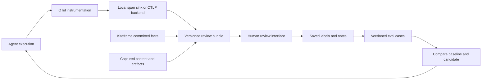

# A pathway from OpenHarness and Kiteframe to declarative, sandboxed agents

Research date: 2026-09-05. Status: proposed direction, not an approved implementation specification. This comparison does not change either project's release gates. Implementation progress remains in OpenSpec; this document is an architectural assessment, not a second task board.

## Recommendation

Build toward **Kiteframe as the durable goal kernel, OpenHarness as an embeddable agent implementation, and an independently replaceable sandbox provider as the compute layer**. Prove each project's smallest useful outcome before joining them. Keep the existing Kiteframe V1 harness path working while OpenHarness matures; introducing OpenHarness should not become a new prerequisite for that release.

The product promise worth testing is: **declare a bounded job once, run it through a chosen harness in an approved environment, survive interruptions, and explain the evidence for its outcome**. YAML, a chat interface, and a running container are supporting pieces rather than sufficient proof of that promise.

The OSS landscape can shorten the infrastructure work substantially. However, adopting both kagent and AX underneath Kiteframe would introduce several overlapping execution controllers. Evaluate one bounded integration at a time, and choose the owner of every state transition before implementing an adapter.

## Scope reduction clarified during plan comparison

The [comparison with existing plans](2026-09-05-pathway-plan-delta.md) distinguishes reused scope, changed delivery order and new integration work. The user directed that required pieces such as the DBOS session runtime can be removed from this pathway, retaining a small interface and an explicit stub for future implementation. DBOS is therefore an optional future backend in this direction, not a prerequisite for a runnable OpenHarness agent or the Kiteframe integration.

Reuse existing execution interfaces where sufficient; specify only the additional session operations a real consumer needs. A stub must explicitly reject unsupported durable execution/resume/recovery and must not silently claim those guarantees through in-memory execution or transcript storage. Defer DBOS workflows, checkpoint replay, orphan recovery and dependent SDK acceptance until a real backend implements and verifies the contract. In the integrated path, Kiteframe owns work recovery and OpenHarness performs a bounded invocation. The existing Layer 6 SDK spec still describes DBOS and needs a focused amendment; this document records the requested direction without implementing that amendment or a runtime.

## Minimal first pass: deep modules with explicit stubs

The user's intended delivery shape is **a minimal first pass with deep modules and small interfaces, followed by a second pass that fills deferred implementations**. The broader pathway below is a destination, not a requirement to ship every subsystem in the first pass.

A deep module hides a complete responsibility behind an interface its callers can use without coordinating its internals. Extensibility belongs at the seams where implementations need to vary; helpers inside the loop do not each need a public plugin interface. Reuse current harness contracts and the planned composition registry. User-requested stubs reserve deferred seams; they are not evidence that a second working adapter exists.

| Module | Small caller-facing interface, described behaviorally | Working first pass | Stub or next pass |
|---|---|---|---|
| Agent execution — OpenHarness | Start one bounded invocation, consume its events/result, cancel it; use existing HarnessRunner/EventStream contracts and relevant Layer 1.5 input support | One real provider/tool loop with bounded execution and an artifact/result; tool admission and cancellation handled inside the module | Durable resume/session recovery explicitly unsupported; session-runtime adapter reserved only where existing contracts cannot express the consumer need |
| Execution environment — worker-owned in Kiteframe integration | Acquire an execution environment under a resolved profile, run the invocation, reconcile/release it using stable identity | First OpenHarness proof uses an explicitly local, non-isolated environment; no guarded-work claim | Sandbox provider adapter is an explicit unsupported stub until the approved worker design and one real backend exist; snapshot, warm-pool and resume implementations follow later |
| Run evidence — OpenHarness capture and later Kiteframe correlation | Capture a run and export a reviewable case bundle with capture status | Real OTel capture at the local invocation/model/tool seams, one export route, result/artifact references and explicit incomplete-capture status | Cross-process propagation, full analytics storage and remote export adapters can follow; durable execution truth remains outside telemetry |
| Evaluation — review tooling | Evaluate a case using a versioned criterion and persist a verdict with evidence | One deterministic artifact/result check over the captured case; export the case for review | Browser annotation persistence and calibrated model judges follow. Unsupported evaluators return unsupported, never a synthetic pass |

These describe responsibilities, not final method signatures or four new mandatory public interfaces. The next specification must map them to existing contracts before adding types. Provider-specific mechanics, tool-loop scheduling, OTel SDK wiring and review storage stay inside their respective modules. A local execution adapter cannot advertise isolation, durability or remote-work capabilities.

**First-pass acceptance:** declare one bounded agent using the minimal available assembly path; run one permitted tool; return an inspectable result/artifact; cancel through the existing execution interface; capture/export a real trace case; run one deterministic check. Selecting a deferred capability must fail clearly before dispatch or any external effect. This does not require the full composition release, DBOS, a sandbox cluster, ACP transport, a browser UI or an LLM judge. Existing composition prerequisites and release acceptance remain separate.

**Second-pass progression:** fill one adapter at a time behind these seams: approved guarded sandbox worker, optional OpenHarness ACP transport, human review UI and repeatable case comparison. Verify lifecycle and error behavior through the same interface callers use. A backend that needs a materially different contract triggers an explicit interface revision; the first pass does not promise that all future backends can fit without change.

## Starting point: what your projects actually contain

| Project | Verified source baseline | Available foundations | Missing for this pathway |
|---|---|---|---|
| OpenHarness | `d00cb18f07ceac5af09603c9619701fcda323ccf` | Eight harness interfaces and Lite implementations; provider clients; tool definitions and effect classification; agent/store types | Integrated agent loop, app registration, composition/profile loader, remote execution implementation, enforced sandbox backend |
| Kiteframe | Local main `06c3abb5aa9385e9b76c5d47e754afa7df6e49de` | `.kite` compilation and immutable publication; frozen GoalContracts; Rust/PostgreSQL lifecycle authority; HarnessPlugin with built-in and ACP harnesses; provider-neutral context/event ingress | Released guarded work delivery and connector/product completion; demonstrated sandbox integration |

OpenHarness's [roadmap](../roadmap.md), [execution order](../superpowers/plans/layer-2/2026-04-13-execution-order.md), and [composition tasks](../../openspec/changes/platform-builder-runtime/tasks.md) agree that the next work is substantial. `openspec status` reports the planning artifacts complete; that does **not** mean the unchecked implementation tasks are complete.

The existing [LiteRunner](../../harness/lite/runner.go) keeps runs in memory, starts a supplied `LoopFactory` in a goroutine, and rejects `Resume`. [SandboxPolicy](../../harness/types.go) is a configuration type. The [exec tool](../../tools/core/exec.go) applies command filtering and a working directory before starting a host shell; that is not an OS isolation boundary. A policy field or a comment saying “sandboxed” must not be presented as an implemented sandbox.

Kiteframe's [current README](https://github.com/swiftdiaries/kiteframe/blob/06c3abb5aa9385e9b76c5d47e754afa7df6e49de/README.md) distinguishes invocation completion from goal completion and records Slice 4 as complete. Its older August 17 design still describes Slice 4 as planned. This assessment uses current code/status evidence for delivery and the design for intended semantics. The local main was ten commits ahead of its remote when inspected; its commit links identify source, not a claim that those commits are publicly available.

The separate golden-thread worktree was at `f7db393b8b285f184accfc6121145ca5b78949e4`, four commits beyond local main, with additional uncommitted fixture/release-gate changes. Its board recorded tickets 1–3 resolved, 4 claimed and 5–81 open. Slice 5 starts at ticket 14. These are a point-in-time local inventory, not merged delivery. The untracked Slice 5 plan is a decision-gated draft; production work authorization, worker leases/fencing and reconciliation are absent. `RequestApproval` in the runtime vocabulary does not establish a working production approval dispatcher.

Kiteframe's current ACP client starts a child process in an absolute workspace with a cleared/configured environment. It does not create an OS/container sandbox. Existing post-acceptance `harness_outcome_unknown` handling should not be confused with the proposed future work-reconciliation flow. [ACP process boundary](https://github.com/swiftdiaries/kiteframe/blob/06c3abb5aa9385e9b76c5d47e754afa7df6e49de/src/harness/acp/client.rs#L455), [harness outcome types](https://github.com/swiftdiaries/kiteframe/blob/06c3abb5aa9385e9b76c5d47e754afa7df6e49de/src/harness/types.rs).

## What the OSS comparison changes

The earlier “Compare with Google AX” task (2026-09-04, task `01a06d87-20df-7f21-9c24-9a3208f0258b`) recommended evaluating AX for OpenHarness's future distributed execution. That remains a useful experiment. With Kiteframe included, the stronger question is whether AX supplies enough additional execution recovery to justify another controller below an existing durable kernel.

| System | Useful capability | Relationship to your projects | Proposed disposition |
|---|---|---|---|
| kagent current main | Compiled agent/runtime configuration, durable A2A tasks, instance lifecycle, checkpoints/forks, Substrate integration | Overlaps both OpenHarness's platform plans and Kiteframe's execution machinery | Borrow design lessons; evaluate as an optional platform integration only when Kubernetes/A2A is a product requirement |
| Google AX | Framework-independent distributed harness execution and recovery | Candidate below a bounded invocation; not the owner of Kiteframe goal acceptance | Run a comparative backend spike after the invocation contract is explicit |
| Agent Substrate | Stateful sandbox actor lifecycle and placement over shared workers | Candidate compute provider used by both kagent and AX | Evaluate directly before implementing equivalent infrastructure |
| Kubernetes SIG agent-sandbox | Kubernetes sandbox resource lifecycle | Alternative when a pod-oriented sandbox fits the workload | Compare against Substrate using one concrete workload |
| OpenHarness | Go agent behavior and application building blocks | Your reusable harness implementation | Finish a narrow runnable vertical before broad platform surfaces |
| Kiteframe | Durable declared intent and evidence-checked goal transitions | Goal authority today; proposed Slice 5 work authority | Preserve and finish the existing product path |

### kagent is a substantive overlap

Pinned main `b8d53d393ee19c1746fabdae3f72d6e471c3f00e` uses `v1alpha3 AgentTemplate` for behavior and `Harness` for runtime/infrastructure policy. Workload images use immutable digests, and artifact references can pin Git commits or object versions. This separation is directly useful for your author/deployer boundary. [AgentTemplate API](https://github.com/kagent-dev/kagent/blob/b8d53d393ee19c1746fabdae3f72d6e471c3f00e/go/api/v1alpha3/agenttemplate_types.go), [Harness API](https://github.com/kagent-dev/kagent/blob/b8d53d393ee19c1746fabdae3f72d6e471c3f00e/go/api/v1alpha3/harness_types.go).

Its PostgreSQL-backed AgentInstance lifecycle has compare-and-set transitions, retryable workflows and deletion fencing. Durable A2A interaction history survives compute deletion. Checkpoints associate an exact snapshot with a revision and history boundary; forks create new instances and contexts. Consequently, “kagent only deploys agents; Kiteframe has durability” would be an incorrect comparison. Current architecture explicitly limits the gateway to one replica because runtime/quiescence coordination is in memory. [Lifecycle](https://github.com/kagent-dev/kagent/blob/b8d53d393ee19c1746fabdae3f72d6e471c3f00e/docs/architecture/runtime-and-lifecycle.md), [checkpoints and forks](https://github.com/kagent-dev/kagent/blob/b8d53d393ee19c1746fabdae3f72d6e471c3f00e/docs/architecture/persistence-checkpoints-and-forks.md).

The narrower distinction is **what completion means**. kagent's gateway maps runtime messages/statuses into A2A task state; Kiteframe checks authorized evidence against a frozen GoalContract. This is an architectural distinction found in these sources, not proof that kagent cannot support an application with similar goal checks. [kagent gateway](https://github.com/kagent-dev/kagent/blob/b8d53d393ee19c1746fabdae3f72d6e471c3f00e/go/core/internal/a2agateway/gateway.go#L648), [Kiteframe lifecycle reference](https://github.com/swiftdiaries/kiteframe/blob/06c3abb5aa9385e9b76c5d47e754afa7df6e49de/docs/reference/agent-runtime-and-goal-lifecycle.md).

Do not copy all semantics indiscriminately. Main documents no generic per-tool approval field for MCP bindings, while some harnesses may widen a requested partial tool selection to the entire server with a warning. Your security-sensitive allowlists should instead reject an incapable profile. [HITL architecture](https://github.com/kagent-dev/kagent/blob/b8d53d393ee19c1746fabdae3f72d6e471c3f00e/docs/architecture/human-in-the-loop.md), [tool binding contract](https://github.com/kagent-dev/kagent/blob/b8d53d393ee19c1746fabdae3f72d6e471c3f00e/go/api/v1alpha3/agenttemplate_types.go#L58).

Version caution: the website still presents `Agent`, `SandboxAgent`, `AgentHarness` and ACP-oriented examples. Those establish earlier capabilities but do not describe the pinned main API. This research does not establish that main's redesign has shipped in a stable release. [Website Substrate documentation](https://kagent.dev/docs/kagent/concepts/agent-substrate/).

### AX and Substrate occupy different boundaries

AX supplies a single-controller execution model and durable event log. Its custom harness protocol sends start/cancel and receives outputs plus a terminal execution result. Compute-level suspension/resumption depends on the backend. AX is early-stage, warns of breaking changes, and currently pauses external pull requests. Treat it as an evaluation candidate, not a release dependency. [AX overview](https://github.com/google/ax), [HarnessService protocol](https://github.com/google/ax/blob/main/proto/ax.proto).

Agent Substrate supplies the physical actor layer: placement, routing and suspend/resume across workers. Both AX and kagent use it. Its own project explicitly says it is not production ready; snapshot persistence does not by itself establish safe retries of external effects. A direct integration may eliminate an unnecessary execution layer, but leaves your adapter responsible for invocation correlation, result delivery and recovery reconciliation. That cost must be measured against AX's benefit. [Substrate](https://github.com/agent-substrate/substrate), [threat model](https://github.com/agent-substrate/substrate/blob/main/docs/threat-model.md).

The sandbox review inspected Substrate at `2fcfa64a73adc682752fd08b75be20aee6cd533f`. It includes Kubernetes control/node components, PostgreSQL and object storage; older integration descriptions of Redis are stale. Its architecture mixes implemented and aspirational behavior, so individual runtime/snapshot features need verification at the selected deployment revision. [Pinned architecture](https://github.com/agent-substrate/substrate/blob/2fcfa64a73adc682752fd08b75be20aee6cd533f/docs/architecture.md).

### Sandbox shortlist for your first experiment

| Candidate | Why evaluate it | What would justify adoption |
|---|---|---|
| **OpenSandbox with Docker** | Local self-hosted lifecycle, command and filesystem APIs, with a Kubernetes path | Recommended first functional spike: lowest cluster burden among these choices; verify the actual runtime and egress controls before claiming strong isolation |
| **Kubernetes SIG agent-sandbox** | Pod-oriented sandbox identity/storage plus claims, templates and warm pools | A Kubernetes-first deployment requirement; configure the isolation runtime explicitly |
| **Agent Substrate** | Process/actor hibernation and multiplexing | Measured need for retained process state or idle-agent density that outweighs operating its early-stage control plane |
| **E2B infrastructure** | Firecracker-based sandbox infrastructure | Self-hosted cloud/KVM operations are acceptable and its latency/recovery behavior wins the workload comparison |

OpenSandbox exposes lifecycle and execution APIs across Docker/Kubernetes; using it avoids implementing those primitives in OpenHarness. Docker alone is not equivalent to a stronger isolation runtime. SIG agent-sandbox's basic quickstart likewise does not configure strong isolation automatically. E2B's self-hosting guide describes a substantial infrastructure setup. These are candidates, not benchmark winners. [OpenSandbox](https://github.com/opensandbox-group/OpenSandbox), [agent-sandbox quickstart](https://github.com/kubernetes-sigs/agent-sandbox/blob/main/examples/quickstart/README.md), [E2B self-hosting](https://github.com/e2b-dev/infra/blob/main/self-host.md).

Substrate is therefore a serious later backend experiment, rather than a prerequisite for the first runnable OpenHarness/Kiteframe integration. The user-requested scope is the pathway from these projects; this shortlist intentionally does not attempt an exhaustive agent-framework catalog.

## Proposed ownership and integration boundary

This is a proposed arrangement, not a working integration. The future guarded worker would control the sandbox hosting the harness; the arrows do not imply that a harness runs twice. Goal authority exists today; work delivery and this sandbox broker do not.

| Concern | Proposed owner | Boundary rule |
|---|---|---|
| Task identity and goal | Kiteframe today | Only its kernel commits goal transitions |
| Work authorization and worker assignment | Target Kiteframe Slice 5 ownership | Requires an approved specification and implementation; preserve separate work authorization, runtime approval and harness permission receipts |
| Model/tool loop and bounded invocation result | Selected harness, including future OpenHarness | Success is evidence for one invocation, not automatic goal success |
| Invocation-to-provider identity mapping | Proposed guarded worker | Persist intent before provisioning and mapping before the effect-bearing prompt; reconcile the same attempt after uncertainty |
| Image, resources, network and credential policy | Deployment profile, enforced by provider/tool boundary | Agent-authored configuration cannot increase privileges |
| Actor start/stop/snapshot and resource reclamation | Sandbox backend | Compute status cannot decide whether a business goal is satisfied |
| Transcript, artifacts and telemetry | Respective stores with correlated IDs | Useful records do not create a second goal authority |

Keep `.kite` as the source of intent. Keep OpenHarness's proposed YAML focused on application composition and profile binding. Image digests, backend choice and resource/security limits would need a new deployment-owned execution profile; these are not fields already implemented by Kiteframe's HarnessProfile. Freeze its resolved digest in work authorization and enforce it at provider launch. Coordinate that schema with planned Slice 6 governance. Do not invent a third agent language or require lossless `.kite` ↔ kagent conversion: their contracts differ.

For the first OpenHarness integration, the concrete recommendation is **an OpenHarness portable ACP server plus a deployment-owned harness profile**. `HarnessPlugin` is Kiteframe's internal Rust trait; `AcpHarnessPlugin` is its ACP implementation, not another name for the protocol. The private ACP methods served to Kiteframe users are a separate surface. Go's `HarnessRunner` is not wire-compatible with any of these, AX gRPC or kagent's private A2A contract.

To run ACP inside a sandbox, propose the Slice 5 worker as the sole sandbox broker. It would provision/reconcile the environment and launch the ACP server inside it, exposing its bounded stream through an explicit worker transport. The current direct host-process launch cannot remain the execution path for such work. The subsequent specification must define this transport and its connection to the internal HarnessPlugin registry; it does not exist today. Avoid adding an independent sandbox controller in OpenHarness alongside that worker. In standalone OpenHarness use, a runner can own its own bounded execution, but it must not also dispatch the same work when hosted by Kiteframe.

## Pathway from your current code

### 1. Establish two useful baselines in parallel

**OpenHarness:** finish the integrated loop (existing Layer 2 Plan 5) using current providers/tools and a small runnable vertical. Plan 4 supplies MCP where the vertical needs it; Plan 6 enables the existing composition change. Demonstrate one configured agent invoking an allowed tool, returning an artifact and responding to cancellation. Build profiles/YAML after the application surface they consume exists. Avoid making Wails, every Enterprise store and the end-user SDK prerequisites for this result.

**Kiteframe:** finish the current golden-thread predecessor/tracer checks (the inspected board's tickets 4–13), then freeze and approve the Slice 5 specification. Evaluate the proposed worker/sandbox ownership boundary at that design gate, before implementing guarded delivery; adding sandbox scope requires an explicit accepted change. Connector evidence and end-to-end completion remain later roadmap work. Keep current harnesses as the baseline, and do not make OpenHarness completion a new Kiteframe V1 dependency.

Exit: OpenHarness has a reproducible bounded example; Kiteframe has passed its predecessor gate and has an approved execution-boundary decision for Slice 5. Source revisions and actual limitations are recorded. This is not a claim that the complete GitHub product is available at this stage.

### 2. Define and prove one sandboxed work attempt

Use a bounded repository task: inspect a pinned checkout, make a small patch, run a specified check, and return the diff and evidence. Keep publication/merge outside the sandboxed coding step. Start with one fresh environment per attempt; snapshots and warm pools are optional follow-ups.

Before implementation, settle invocation ID, expected task/work revision, authorization identity, image/profile digest, workspace/artifact ownership, cancellation acknowledgement, cleanup and the uncertain-outcome path. Implement the bounded sandbox attempt through the approved Slice 5 worker contract, rather than bypassing guarded work through a provider API. OpenSandbox/Docker is the recommended first functional backend experiment; an isolation runtime must be explicitly configured for an untrusted-code claim.

Exit: exercise crashes separately after kernel work-intent commit, provider create before mapping acknowledgement, prompt/effect acceptance, terminal commit, and result acknowledgement. Restart the responsible kernel or worker process at each boundary. Use deterministic provider identity/idempotent creation or lookup to recover provisioning; if the provider cannot establish the outcome, enter uncertainty instead of creating again. Persist the provider mapping before sending a potentially mutating prompt. Reject stale results and reconcile the same attempt. Lease expiry does not prove a process stopped or fence its filesystem writes. Also prove resource limits, egress policy and cleanup on the chosen backend.

### 3. Add OpenHarness as an optional Kiteframe harness

Wrap the runnable OpenHarness vertical in the portable ACP server contract, map committed terminal output through Kiteframe's bounded `harness.invocation_result` evidence path, and exercise it through the worker's sandbox transport. An artifact or ContextBundle is not automatically authorized goal evidence. Keep domain tools in the vertical and generic behavior in OpenHarness. Do not require feature parity with all existing harnesses to ship the first adapter.

Exit: the same bounded work attempt runs through a selected existing out-of-process ACP profile and OpenHarness with the same authorization, artifact and goal-acceptance rules. The in-process built-in Responses harness remains on its current baseline path; moving it into this sandbox transport would require separate work. A harness reporting success with insufficient evidence cannot complete the goal. Cancellation and unsupported-capability behavior are explicit. External GitHub check/review/merge evidence and complete `babysit_pr` acceptance still require the later connector/product slices.

### 4. Choose infrastructure using measured need

Compare direct Substrate with AX-on-Substrate only if retained process state or dense idle-agent multiplexing is needed. Compare a pod-oriented backend if ordinary isolated environment lifecycle suffices. Record cold/warm start, suspended cost, recovery correctness, cleanup and operating burden; do not select solely from upstream performance claims.

Exit: one pinned provider meets the workload's correctness and operating criteria. Add an optional kagent integration when Kubernetes authoring, A2A tooling or its UI is a demonstrated requirement. Keep Kiteframe goal acceptance separate from subordinate kagent task completion.

### 5. Package the successful path for OSS users

Publish one example and deployment profile with a concise compatibility table: authoring revision, harness/protocol version, sandbox backend version, supported recovery level and known limitations. OpenHarness currently says `License: TBD` and has no top-level license file in this baseline; an explicit project licensing decision belongs before presenting it as a consumable OSS platform.

Grow the abstraction only after the first backend and harness pass. Potential upstream work includes recovery conformance cases and substrate adapter fixes; AX's current contribution pause favors issue feedback first. No upstream messages or pull requests are authorized or sent by this research.

## Authentication: resumable login for agents

Add a deep authentication module whose interface supports a login that outlives a CLI process. Existing plans cover [workspace-scoped bearer authentication](../superpowers/specs/2026-04-17-layer-6-sdk-design.md#auth-multi-tenancy-and-lite-hardening) and [MCP OAuth credentials through SecretStore](../superpowers/specs/2026-04-13-openharness-layer-2-agent-primitives-design.md#mcp-oauth-via-secretstore), but do not specify this interaction. Those are planned foundations, not evidence of an implemented login service.

[Dosu's CLI login design](https://dosu.dev/blog/cli-login-flow-for-coding-agents) supplies the interaction model: request a short-lived login ticket, return a browser URL and a command for checking it, exit, then complete the exchange from a new process after the human explicitly authorizes access. Its custom ticket protocol is inspired by device authorization; it is not a full RFC 8628 implementation. Adopt the resumable interaction without committing our interface to that particular protocol.

### Small interface, provider-specific implementation

| Caller operation | Interface contract | Hidden implementation |
|---|---|---|
| Begin login | Return a pending challenge, verification URL, expiry and structured next action; do not block waiting for browser interaction | Provider discovery/protocol, challenge creation and protected continuation state |
| Check/complete login | Accept an opaque continuation reference and return pending, authenticated, denied or expired; support a fresh CLI process | Polling limits, exchange, credential storage and recovery from interrupted completion |
| Status/logout | Report usable identity/workspace and credential status; remove local credentials and report remote revocation outcome where supported | Refresh, secure storage and provider-specific revocation |

These are behavioral responsibilities, not final method signatures. Reuse SecretStore for credential storage and existing authentication contracts where sufficient. CLI commands are thin adapters over this module. Platform login and outbound MCP login may share interaction types, but retain distinct audiences, scopes and credential namespaces.

The CLI should return machine-readable status such as `need_user_action`, an expiry and a structured next action that can be rendered as a resume command. Treat these fields as a versioned interface. Opening a URL must not itself authorize access: the human must explicitly approve the intended account/workspace and requested access. Pending authorization is a normal state, not an authentication failure or a reason to spin in a blocking command.

Keep exchange secrets in protected continuation storage when possible, exposing an opaque reference rather than credentials to the agent. Completion returns identity/status or a credential reference; access and refresh tokens never appear in terminal JSON, model context or trace payloads. Challenge values and verification URLs may also be sensitive and must be redacted from OTel/review bundles. Trace operation, correlation ID and state transitions instead.

A later real adapter must define expiration, denial, bounded polling and one-time exchange behavior. It must also handle an exchange that succeeds before the CLI persists its credential: a retry must either recover safely under a defined protocol or require a new login, never report authentication merely because the ticket disappeared. Browser credentials must remain separate from the CLI credential lifecycle.

### First pass and next pass

**First pass:** preserve credential-based authentication as the minimal planned path; add only the interface needed by its consumer and an interactive-login stub that returns unsupported immediately. Existing bearer-auth plans still require implementation and validation; this section does not claim they already work. A stub cannot create a fake approval URL, report a successful login or silently weaken authentication. The local agent proof does not require a hosted login service.

**Next pass:** implement one browser-assisted adapter behind the same interface, with protected continuation state that survives CLI restarts. Choose a standard device-authorization adapter where the selected identity provider supports it, or specify a narrowly scoped ticket service explicitly; do not build both initially. Login establishes identity. Tool permissions, sandbox policy and Kiteframe work authorization remain separate checks and are not granted by a successful login.

Acceptance should exercise the caller interface across separate processes: request exits promptly; the agent presents the URL and waits for human action; pending remains pending; explicit approval completes; denial/expiry are reported; duplicate exchange and interrupted completion are handled; logout reports its effect; secrets are absent from output and traces. Add a whole-case review/eval fixture for the conversational handoff, since valid JSON alone cannot prove that the agent explained the human's next step correctly.

## Evaluation: OTel traces, human review and repeatable cases

Add evaluation alongside the first runnable vertical. The purpose is to check whether a change to an agent, harness or sandbox improves the work without breaking its constraints. **OTel records execution; human review judges the result; eval cases make that judgment repeatable.** This section is proposed architecture, not an implemented eval system.

### Build on the existing telemetry design

OpenHarness already specifies a relational trace index and a separate span sink: SQLite plus DuckDB/Parquet for Lite, and PostgreSQL plus OTLP export for Enterprise. The current `TraceRecorder` has a no-op implementation; the OpenAI-compatible provider adds events to an existing span but does not create a complete trace. OTel API dependencies alone do not configure an SDK or exporter. Telemetry bindings remain deferred in the composition change. [Trace storage design](../superpowers/specs/2026-04-10-openharness-extraction-design.md#trace-instrumentation--two-layer-architecture), [recorder interface](../../agent/interfaces.go), [provider instrumentation](../../providers/openai_compat.go), [pending bindings](../../openspec/changes/platform-builder-runtime/tasks.md).

Kiteframe currently uses Rust `tracing` and a formatted subscriber. An OTel bridge, exporter and propagation across process boundaries are additional work. Its durable task and invocation records remain the source of execution facts; telemetry must not become the goal ledger. [Kiteframe dependencies](https://github.com/swiftdiaries/kiteframe/blob/06c3abb5aa9385e9b76c5d47e754afa7df6e49de/Cargo.toml), [subscriber setup](https://github.com/swiftdiaries/kiteframe/blob/06c3abb5aa9385e9b76c5d47e754afa7df6e49de/src/main.rs#L419).

The last arrow means a new isolated test execution. It does not mean replaying production tool calls or applying eval labels to a live goal.

### 1. Instrument actual execution boundaries

Create spans around operations while they execute, rather than reconstructing a timing tree from completion callbacks. The existing `RecordLLMCall` and `RecordToolCall` methods cannot by themselves supply child contexts for nested provider calls. Extend the recorder contract or introduce wrappers that start a span, pass its context into the call, then finish it. Assign one owner to each span to avoid duplicates from automatic and manual instrumentation.

| Component | Capture |
|---|---|
| Kiteframe | Task acceptance, command dispatch, invocation acceptance/result, recovery and committed goal transitions |
| OpenHarness | Agent invocation, each model call, retrieval and each tool execution |
| Future guarded worker | Work attempt, authorization reference, sandbox create/attach, process start, cancellation, result delivery and cleanup |
| Sandbox provider | Available lifecycle timings/status and provider identity; mark unavailable internals explicitly |

Use OTel GenAI conventions for model/agent/tool operations and namespaced application fields for Kiteframe/OpenHarness facts. Pin the convention version: GenAI conventions are still marked Development. Record model, token usage, duration and error details, together with task/invocation/attempt IDs and resolved agent, prompt, tool, harness and execution-profile versions. Use source revisions and image digests for provenance. Keep unique IDs on spans, not as unbounded metric dimensions. [Current GenAI conventions](https://github.com/open-telemetry/semantic-conventions-genai/blob/main/docs/gen-ai/gen-ai-spans.md).

Propagate trace context across supported boundaries. ACP does not automatically carry arbitrary OTel metadata; the new worker transport and any supported harness extension need an explicit carrier. An external harness without internal tracing gets an observed invocation span and a declared visibility limit. For resumed work, create new attempt spans and use links plus stable task/invocation IDs to connect them. Do not keep a single span open throughout a days-long goal. [OTel context and span links](https://opentelemetry.io/docs/concepts/signals/traces/).

Keep provider HTTP retries, harness pre-accept attempts and future worker generations as separate identities. Order Kiteframe facts by committed revisions and event sequence, not timestamps alone. Map host-specific IDs at the adapter so OpenHarness need not import Kiteframe domain types. Trace context is untrusted diagnostic metadata: it must not affect authorization, idempotency, revision checks or goal completion. Invalid or absent context changes tracing only.

Capture permitted messages, tool arguments/results and artifact references separately when necessary; spans with only durations cannot support content review. Make content capture explicit, redact credentials before storage/export, and indicate omitted or truncated content. Include emitted explanations when available; never require private model reasoning. Store large diffs and logs as access-controlled artifacts with digests, not enormous span attributes. OTel content recording is optional. [GenAI content capture](https://opentelemetry.io/blog/2026/genai-observability/).

### 2. Review one complete case, not one span

Define a versioned review bundle containing the input task, declared review scope, expected result/rubric, committed outcome, ordered attempts, related trace/span IDs, permitted messages/tool activity, artifacts and a capture-completeness report. Pin the bundle digest. A bounded patch/test attempt and a complete `babysit_pr` goal are different review scopes; do not score them as if they were the same case. One case may include multiple OTel traces after recovery.

Keep execution outcome separate from capture status: distinguish complete, partial, disabled, sampled-out and export-failed capture. A no-op recorder means disabled capture, not an empty successful trace. Build the completeness report from required records in the case contract versus observed records; span count alone cannot prove completeness. Retain a committed outcome snapshot even if its trace is unavailable.

Build the browser interface using the supplied `build-review-interface` workflow:

- Load normalized JSON or CSV exports. Display one whole case at a time, with the task, result, patch and test evidence prominent. Show all attempts and captured intermediate steps; collapse repeated prompts, verbose tool output and diagnostics.
- Render Markdown, highlighted code/diffs, tables and collapsible JSON. Link each tool call to its result. Strip raw HTML and disable remote images. Show missing/redacted content explicitly.
- Provide **Pass, Fail, Defer and notes**. Start without failure-category tags; derive categories later from actual reviewer notes. A review label never grants work permission or completes a Kiteframe goal.
- Auto-save labels and notes to local SQLite, keyed by case/bundle revision, rubric version and reviewer. Retain edits for undo; show save failure rather than claiming success. Keep annotations logically separate from trace metadata and goal state.
- Provide previous/next, ID lookup, progress counts and metadata filters. Support arrows, `1`/`2`, `D`, `U`, `Cmd+S` and `Cmd+Enter`; typing in notes must not trigger navigation or labels.

The reference panel should state what Pass means for this case. For patch/test work, that includes satisfying the requested change within authorized scope and providing sufficient evidence. Keep kernel outcome, objective-check results and human judgment visible as separate facts. If missing data prevents judgment, Defer rather than infer success or failure.

### 3. Turn reviewed failures into eval cases

Keep sampling outside the interface. Start with a seeded random sample from a known population of runs. Later add targeted samples for diagnosis, but report those separately from estimates of normal performance. Select whole cases from the run inventory; sampling only retained error spans would bias the review set. Controlled eval runs should request full trace capture and verify completeness, since an exporter can still drop data.

After reviewing the first batch, describe observed failure patterns and preserve representative cases. Each case needs a pinned input/repository fixture, agent and harness configuration, sandbox image/profile, expected checks, rubric version and source-review lineage. Split related cases by task/repository into development and held-out sets so near-duplicates do not inflate results.

Use three forms of evaluation:

| Form | What it checks |
|---|---|
| Deterministic checks | Patch scope, tests, schema/capability contracts, cleanup, forbidden effects, stale-result rejection and crash/recovery invariants |
| Human review | Whether the change actually solves the request, uses suitable tools and supplies convincing evidence |
| Later, calibrated model judges | Specific observed failure modes that need interpretation; validate on held-out human Pass/Fail labels before using as a gate |

Eval execution uses fresh sandboxes and fixture connectors or explicitly bounded read-only integrations. Viewing a trace never re-executes a tool. Separate offline artifact checks, deterministic fault injection and fresh model executions: they answer different questions. Record model/version/settings and repeat variable cases; a seed alone does not guarantee identical model outputs.

Compare baseline and candidate on the same cases, changing one component at a time where possible. Report objective pass rate, human Pass/Fail/Defer counts, capture coverage, recovery outcomes, latency and cost separately. Missing evidence and infrastructure errors must remain visible in the denominator/status report. Safety/correctness gates should not be averaged away by a cheaper or faster run. Judge validation should report missed failures and false alarms, not only overall agreement.

### 4. Make the eval path extensible

Use the existing recorder and span-sink direction; add only the following proposed boundaries when their first implementations are needed:

| Extension point | Initial implementation | Replacement stays responsible for |
|---|---|---|
| Trace recorder and sink | OTel instrumentation plus local capture or OTLP | Context, schema version, redaction and capture-loss reporting |
| Review source | JSON/CSV bundle importer/exporter | Complete case identity, ordering and provenance |
| Annotation store | Local SQLite | Auto-save, reviewer/rubric/bundle identity and undo history |
| Evaluator registry | Named deterministic checks | Versioned inputs/results, explicit errors and no live-goal mutation |

An eval manifest should declare dataset revision, candidate agent/harness/execution-profile references, registered evaluators and rubric version. This is a proposed schema, not existing `openharness.yaml` syntax. Keep production composition and eval experiments separate. Selecting an evaluator by name does not authorize loading arbitrary code or credentials. A future telemetry backend adapter can export bundles without coupling the reviewer to that backend's UI or private database schema.

### 5. Deliver it with the pathway

First, instrument one actual OpenHarness vertical and the current Kiteframe invocation boundary; export a complete review bundle. Next, build the local review page and label a small random batch. Then convert reviewed cases into regression checks and add baseline/candidate comparison. Add worker/sandbox spans as the approved execution path lands, and add model judges only after labeled evidence exists.

Acceptance includes both the data path and the UI: prove cross-boundary correlation, restart links, no secret leakage, and visible incomplete capture when export fails. Telemetry export failure must not change a live goal outcome; an eval requiring that capture is marked incomplete. Use Playwright screenshots at desktop/mobile sizes and a workflow test covering Pass, Fail with notes, Defer, undo, navigation, all shortcuts, expanded content and persistence after reload. No UI or instrumentation has been implemented or tested by this document change.

## Decisions to carry into a subsequent specification

1. Which first user outcome proves the product: the existing `babysit_pr` goal, with a bounded patch/test work attempt as its sandbox unit, is the recommended starting point.
2. Whether the first execution target must be Kubernetes. Keeping the initial semantic contract independent of it preserves local development; cluster operations can be evaluated separately.
3. Whether process-memory resume is required now. Start with fresh attempts plus durable reconciliation unless retaining process state solves an observed problem.
4. Whether OpenHarness remains a general embeddable framework or narrows toward reusable coding harnesses. The first vertical provides evidence before committing to its full six-layer expansion.

These are recommendations to turn into an approved change, not decisions silently adopted here. No product implementation or infrastructure deployment was performed. Validation for this research consists of source inspection, references and OpenSpec/document checks, not runtime reliability or isolation certification.
